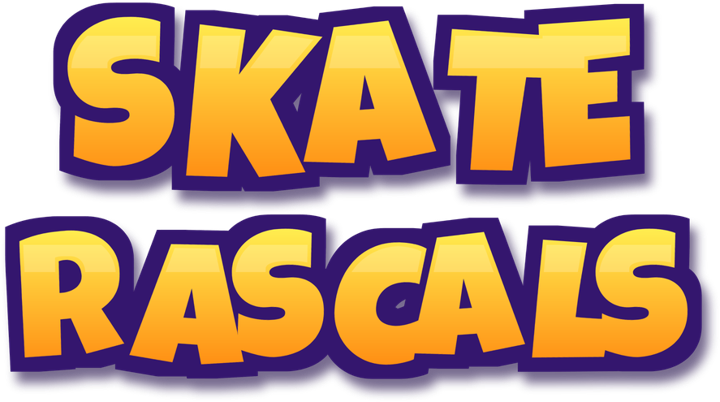

# Skate Rascals — informations légales et assistance

Dernière mise à jour : 30 septembre 2026.

Skate Rascals est un jeu mobile de course en skateboard au style cartoon : le joueur affronte des concurrents gérés par l’ordinateur sur des parcours et des circuits, attrape des bonus, utilise le pouvoir de son personnage et débloque de nouveaux personnages avec les pièces gagnées.

Éditeur : Développement-Solution — Olivier Pagé, France.

La version actuelle enregistre la progression uniquement sur l’appareil. Elle ne crée pas de compte joueur en ligne et ne propose aucun paiement réel. Le jeu est prévu pour être financé par la publicité ; ces pages seront mises à jour avant l’activation de toute publicité réelle ou de tout changement affectant les données.

- [Politique de confidentialité](confidentialite.html)
- [Suppression du compte et des données](suppression.html)
- [Contact et informations sur l’éditeur](contact.html)

---

<a href="index.html">Accueil</a> · <a href="confidentialite.html">Confidentialité</a> · <a href="suppression.html">Suppression du compte et des données</a> · <a href="contact.html">Contact et éditeur</a>

